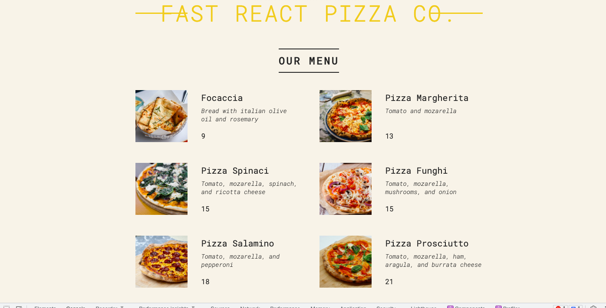
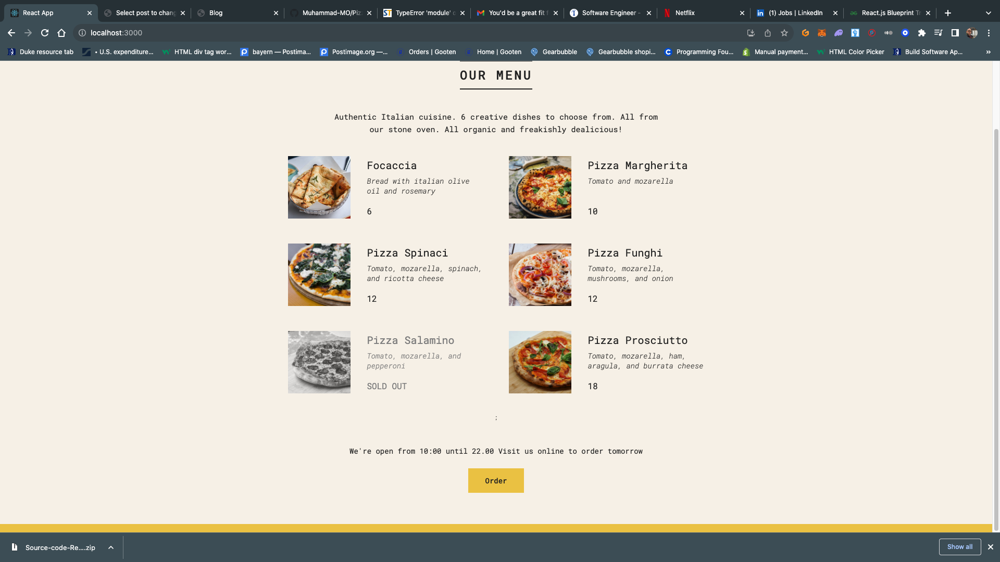

# PizzaMenu

<h2>About this Project</h2>
This Project uses React to create a simple pizza menu

<h2>What I benefited from this exercise</h2>

Working on this project reinforces my understanding of the following React comcepts

1. Functional components
2. JSX elements,
3. Rendering data to the client side and
4. Properties
5. Conditionl Rendering with && operators
6. Conditional Rendering with Ternaries
   It also further cements my knowledge of Javascriot CSS and HTML all of which are critical tools in todays web development
   7.Styling of React Applications
7. Renderig lists
8. React Fragment
9. Conditional text and classes
10. Conditional rendering with ternary operators and multiple returns

This applicaion is currently being buult and this he Readme file will get updated continuously

<h2>Resouces</h2>

1. <a href="https://www.w3schools.com/react/default.asp" target="blank">W3 Schools</a>
2. <a href="https://stackoverflow.com/search?q=react&s=8491947b-fcec-4412-ad88-358e2484e05b" target="blank">Stackoverflow</a>

